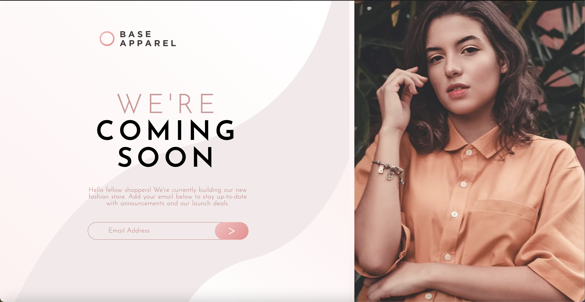
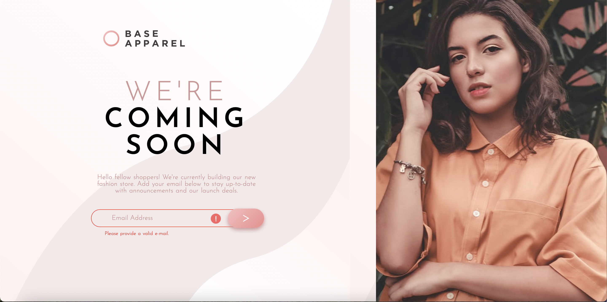
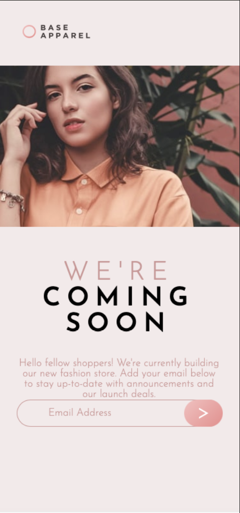

# Frontend Mentor - Base Apparel coming soon page solution

This is a solution to the [Base Apparel coming soon page challenge on Frontend Mentor](https://www.frontendmentor.io/challenges/base-apparel-coming-soon-page-5d46b47f8db8a7063f9331a0). Frontend Mentor challenges help you improve your coding skills by building realistic projects. 

### Screenshot

### Links

- Solution URL: [GitHub](https://github.com/13Groszy/FrontendMentorCommingSoon)
- Live Site URL: [Netlify App](https://fementorcommingsoon13groszy.netlify.app/)

## My process
Simple HTML skeleton, basic css with mind on mobile-first view. Straight after that, I focused on desktop view, finished everything in CSS and at the end I created simple JS script which work with button.

### Built with

- Semantic HTML5 markup
- CSS custom properties
- CSS Grid
- Mobile-first workflow

### Continued development

Area where I will need to focus at the moment is refreshing JavaScript.

## Author

- Website - [Mateusz Daszkiewicz](https://www.mdaszkiewicz.netlify.app)
- Frontend Mentor - [@13Groszy](https://www.frontendmentor.io/profile/13Groszy)
- LinkedIn - [Mateusz Daszkiewicz](https://www.linkedin.com/in/mateusz-daszkiewicz-66371a196)